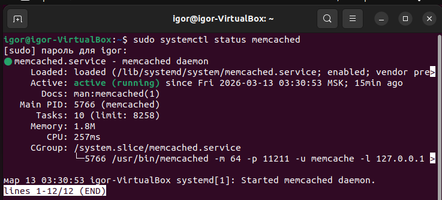
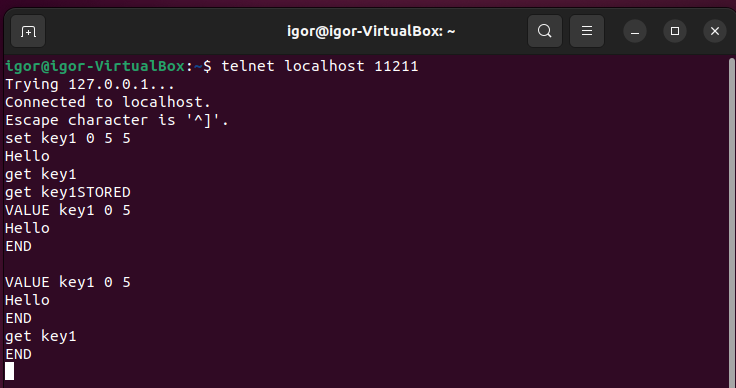
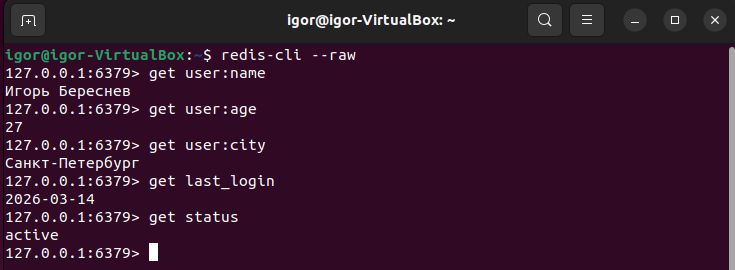

# Домашнее задание к занятию «Кеширование Redis/memcached»
Выполнил: Береснев Игорь Андреевич

---

## Задание 1. 

Приведите примеры проблем, которые может решить кеширование.
Приведите ответ в свободной форме.

Проблемы, которые решает кеширование:
Медленная база данных — частые запросы тормозят сайт, кеш отдаёт данные быстрее.
Высокая нагрузка на сервер — много пользователей одновременно, кеш снижает количество обращений к базе.
Долгие вычисления — сложные отчёты или выборки считаются один раз и сохраняются в кеш.
Внешние API — погода, курсы валют, платежи. Кеш хранит ответы, чтобы не дёргать внешние сервисы каждую секунду.
Сессии пользователей — данные авторизации, корзина в магазине хранятся в кеше, а не в базе.
Одинаковые запросы — сотни людей просят одно и то же (например, главную страницу), кеш отдаёт копию без нагрузки на сервер.

## Задание 2.

Установите и запустите memcached.
Приведите скриншот systemctl status memcached, где будет видно, что memcached запущен.

### Скриншот Memcached

## Задание 3.

Запишите в memcached несколько ключей с любыми именами и значениями, для которых выставлен TTL 5.
Приведите скриншот, на котором видно, что спустя 5 секунд ключи удалились из базы.

### Скриншот Удаление по TTL в Memcached

## Задание 4.

Запишите в Redis несколько ключей с любыми именами и значениями.
Через redis-cli достаньте все записанные ключи и значения из базы, приведите скриншот этой операции.

### Скриншот Запись данных в Redis

